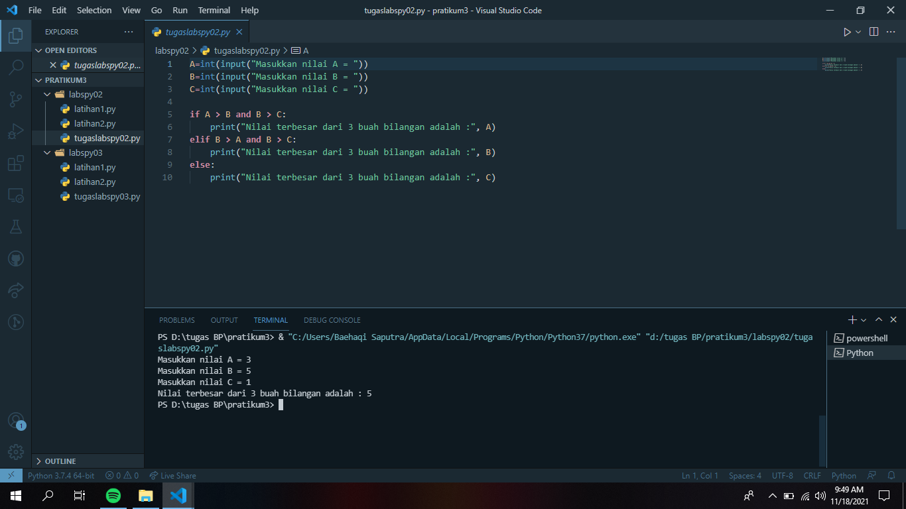

# pratikum3

## Tugas labspy02 dan labspy03 serta membuat latihan dari lab 1

### tugas pratikum 2
program sederhana dengan input tiga buah bilangan, dari ketiga bilangan tersebut 
menampilkan bilangan terbesar. mengunakan statment if

### tugas pratikum 3
program sederhana dengan perulangan. seorang pengusaha menginvestasikan uangnya untuk memulai  usahanya dengan
modal awal 100 jt, pada bulan pertama dan kedua belum mendapatkan laba. pada bulan ketiga baru mulai mendapatkan 
laba sebesar 1% dan pada bulan ke 5,pendapatan meningkat 5%, selanjutnya pada bulan ke 8 mengalami penurunan keuntungan sebesar 2%, sehingga laba menjadi 3%. 

### membuat program sederhana dengan input 2 buah bilangan
ini contoh program sederhana dengan input 2 buah bilangan, untuk menentukan bilangan terbesar dari kedua bilangan
tersebut, menggunakan statment if

### program untuk mengurutkan data berdasarkan input sejumlah data 
ini contoh program untuk mengurutkan data berdasarkan input sejumlah data, dan hasil dari perurutan 
tersebut dimulai dari data terkecil

### program dengan perulangan bertingkat (nested)
contoh program dengan perulangan bertingkat (nested) for yang menghasilkan output sebagai berikut beserta hasil runing

### program n bilangan acak yang lebih kecil dari 0.5
menggunakan kombinasi while dan for 

TERIMAKASIH

